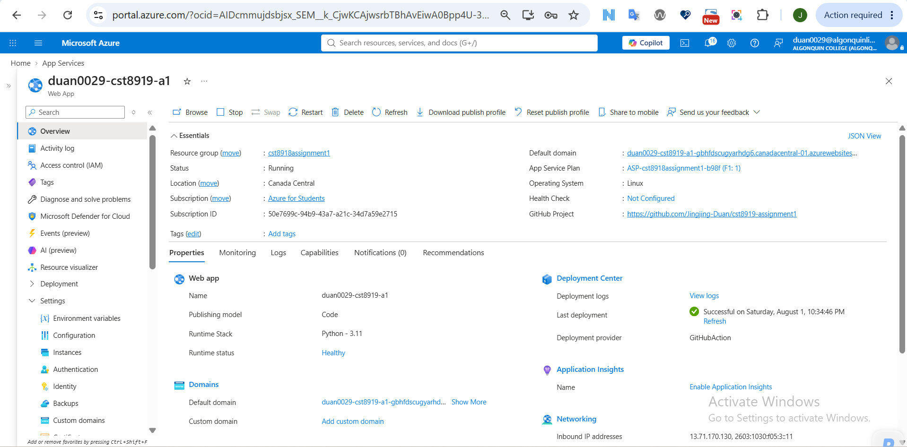
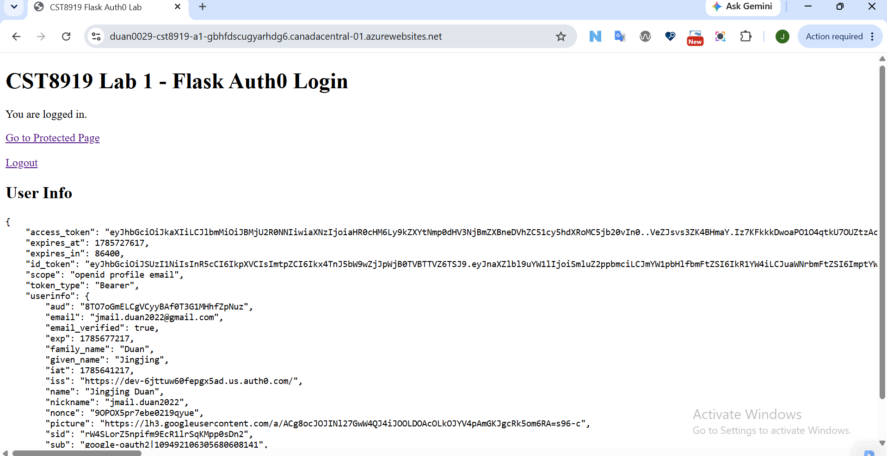
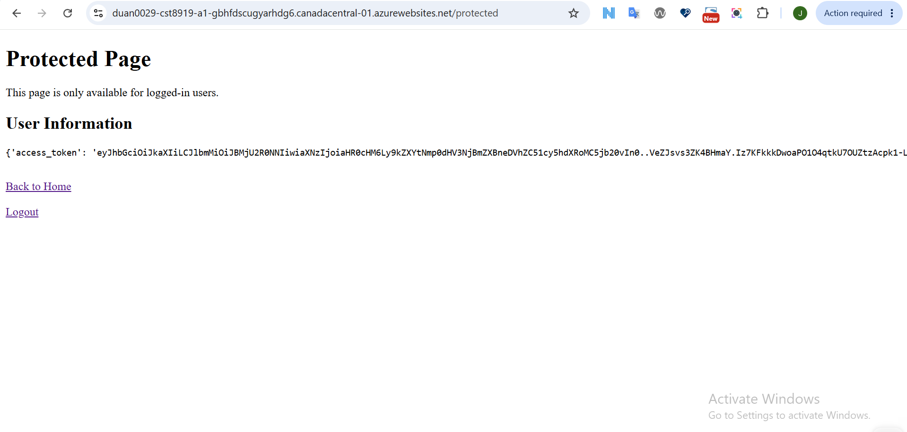
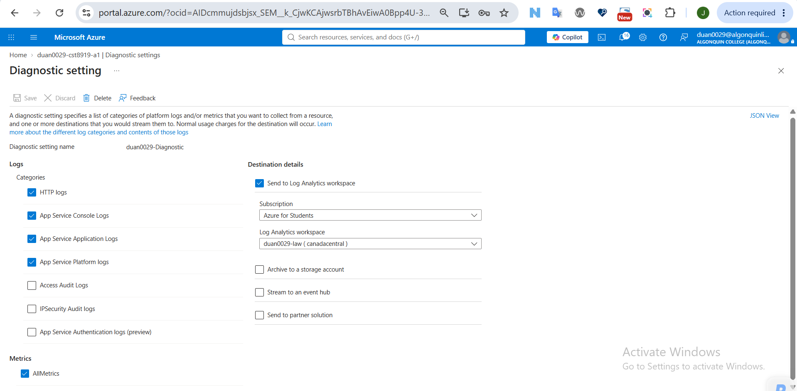
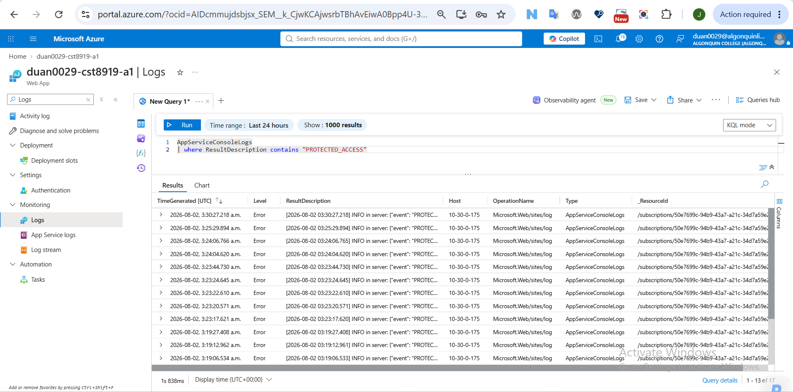
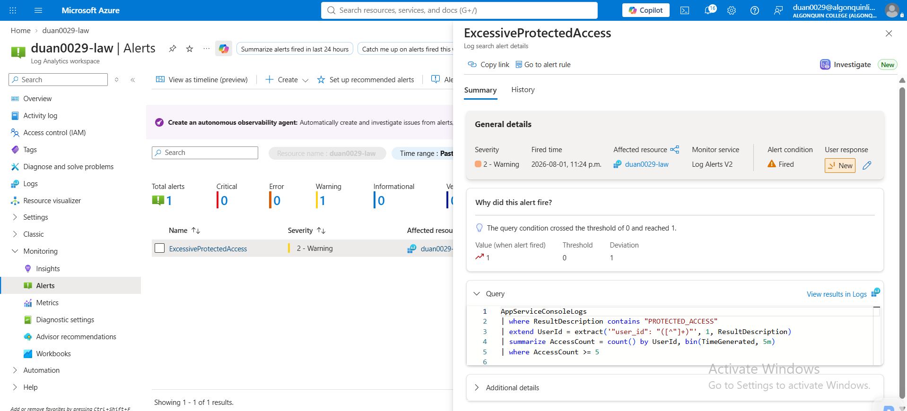
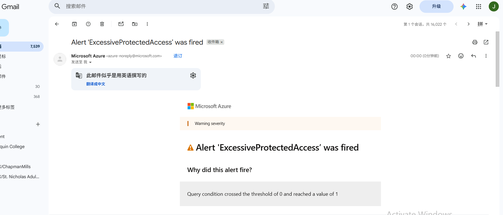

# CST8919 Assignment 1 – Securing and Monitoring an Authenticated Flask App

## Student Information

**Name:** Jingjing Duan

**Course:** CST8919 – DevOps - Security and Compliance

---

# Project Overview

This assignment extends the Flask application developed in Lab 1 by integrating authentication, monitoring, and security logging in Microsoft Azure.

The application uses Auth0 for user authentication and is deployed to Azure App Service. User activities are logged and collected by Azure Monitor. Log Analytics and Kusto Query Language (KQL) are used to detect suspicious behavior, and Azure Alert Rules are configured to notify administrators when abnormal activities are detected.

---

# YouTube Demo Link
https://youtu.be/3EGs9jwmFSA


---

# Technologies Used

- Python 3.11
- Flask
- Auth0
- Azure App Service
- Azure Monitor
- Log Analytics Workspace
- Kusto Query Language (KQL)
- GitHub Actions

---

# Setup Steps

## Auth0 Configuration

1. Create an Auth0 Regular Web Application.
2. Configure the callback URLs:
   - `http://localhost:3000/callback`
   - `https://<app-name>.azurewebsites.net/callback`
3. Configure the logout URLs:
   - `http://localhost:3000`
   - `https://<app-name>.azurewebsites.net`
4. Obtain the Auth0 credentials:
   - AUTH0_DOMAIN
   - AUTH0_CLIENT_ID
   - AUTH0_CLIENT_SECRET

## Azure Deployment

1. Create an Azure App Service.
2. Deploy the Flask application using GitHub Actions.
3. Configure the required application settings in Azure App Service.
4. Enable Diagnostic Settings and send logs to a Log Analytics Workspace.

## .env Configuration

For local development, the following environment variables are stored in a `.env` file. In Azure App Service, the same values are configured as Environment Variables.

```text
APP_SECRET_KEY
AUTH0_DOMAIN
AUTH0_CLIENT_ID
AUTH0_CLIENT_SECRET
```

---

# Application Features

## Authentication

The application uses Auth0 to authenticate users.

Authenticated users can:

- Log in securely
- Access the protected page
- Log out

Unauthenticated users attempting to access the protected route are redirected to the login page.

---

## Logging and Detection Logic

All application logs are written using the Flask logger (`app.logger`). Azure Monitor collects these logs through App Service Diagnostic Settings and stores them in the Log Analytics Workspace for querying and alerting.

The application records the following security events:

### Login Success

When a user successfully logs in, the application logs:

- User ID
- Email address
- Timestamp

Example:

```json
{
  "event":"LOGIN_SUCCESS",
  "user_id":"auth0|xxxx",
  "email":"user@example.com"
}
```

---

### Protected Route Access

Whenever an authenticated user accesses `/protected`, the application records:

- User ID
- Email
- Route

Example:

```json
{
  "event":"PROTECTED_ACCESS",
  "user_id":"auth0|xxxx",
  "email":"user@example.com",
  "path":"/protected"
}
```

---

### Unauthorized Access

If an unauthenticated user attempts to access `/protected`, the application records:

- Event type
- Client IP address
- Requested path

Example:

```json
{
  "event":"UNAUTHORIZED_ACCESS",
  "path":"/protected",
  "ip_address":"127.0.0.1"
}
```

---

# Monitoring

Azure Monitor is configured to collect application logs.

Diagnostic Settings send the following logs to Log Analytics Workspace:

- App Service Console Logs
- App Service Application Logs
- HTTP Logs
- Platform Logs

---

# KQL Query and Alert Logic

The following KQL query detects users who access the protected route five or more times within a five-minute period. Azure Monitor evaluates the query every five minutes. When the query returns one or more results, the alert rule is triggered and an email notification is sent through the configured Azure Action Group.


```kusto
AppServiceConsoleLogs
| where ResultDescription contains "PROTECTED_ACCESS"
| extend UserId = extract('"user_id": "([^"]+)"', 1, ResultDescription)
| summarize AccessCount = count() by UserId, bin(TimeGenerated, 5m)
| where AccessCount >= 5
```

---

# Alert Rule

An Azure Alert Rule is configured using the KQL query above.

Alert configuration:

- Evaluation Frequency: 5 minutes
- Time Window: 5 minutes
- Threshold: Greater than 0 results

The alert is triggered when a user accesses the protected route five or more times within five minutes.

An Azure Action Group is configured to send email notifications when the KQL query detects suspicious activity. During testing, repeated access to the protected route triggered the alert successfully, and an email notification was received through the configured Azure Action Group.

---

# Screenshots

## Azure App Service



---

## Successful Authentication



---

## Protected Route



---

## Diagnostic Settings



---

## Log Analytics Query



---

## Alert Rule



---

## Alert Email Notification



# Conclusion

This assignment demonstrates how authentication, centralized logging, monitoring, and alerting can be integrated into a cloud-hosted Flask application. 

By combining Auth0, Azure App Service, Azure Monitor, Log Analytics, KQL, and Azure Alert Rules, the application is able to record user activities, detect suspicious access patterns, and notify administrators automatically. This solution improves both the security and observability of the application.